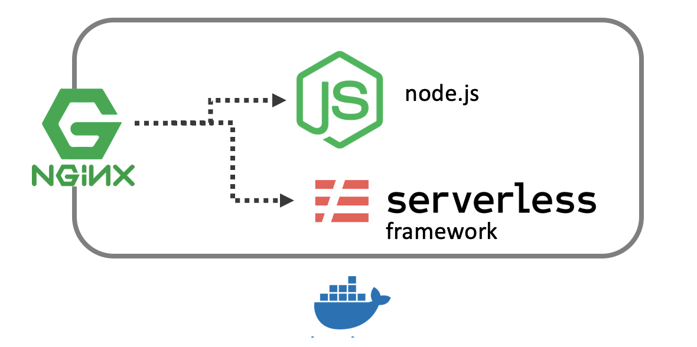

# Dockergate

 
 

### What is Dockergate

DockerGate is a Docker Image with an Nginx Router,
that will route traffic to a Serverless Framework
API Gateway and a Node.js Server.

### Why do I want this

Dockergate allows you to simulate a Cloud IAAS
easily. 

### How do I run this

Easy !

`docker run -it -p 3000:3000  -e github="https://github.com/pmcdowell-okta/dockerGateway.git"  oktaadmin/dockergate`

### Technicals

Dockergate sends traffic to Nginx which is running
on port 3000. All traffic is routed to the Node.js
Server, except for request that begin with 
/apigateway , this traffic is routed to the 
Serverless Framework.

You can test the Node.js Application directly
by hitting port 3001, and the Serverless Framework
API Gateway is running on port 3002

### Tuning

You can change port(s) and URL(s) to your liking. 

Nginx configurations can be made from the [./nginx.conf](./nginx.conf)
file.

The Serverless Framework Offline Gateway ports can be changed in the [Makefile](./Makefile)

